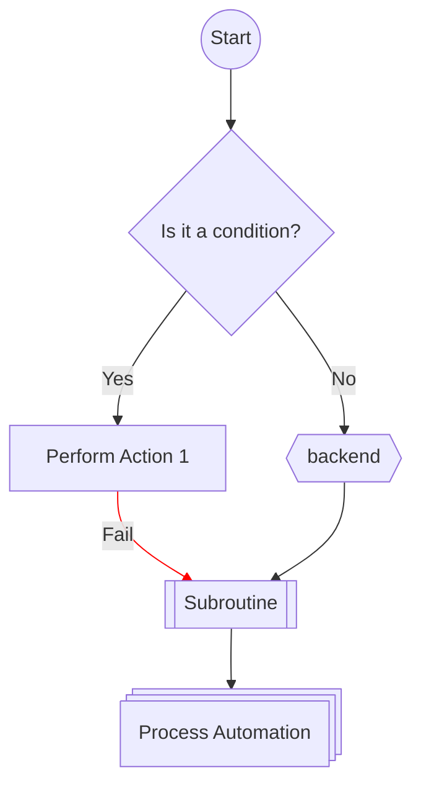

# Sample Section Identifier

In this sample, the section identifier is my-section

<!-- my-section-start -->

```mermaid
flowchart TD
    A@{ shape: circle, label: "Start" }
    A --> B{Is it a condition?}
    B -->|Yes| C[Perform Action 1]
    B -->|No| D{{backend}}
    C --> |Fail| E[[Subroutine]]
    linkStyle 3 stroke:red
    D --> E
    E -->  F@{ shape: procs, label: "Process Automation"}
```
<!-- my-section-end -->
